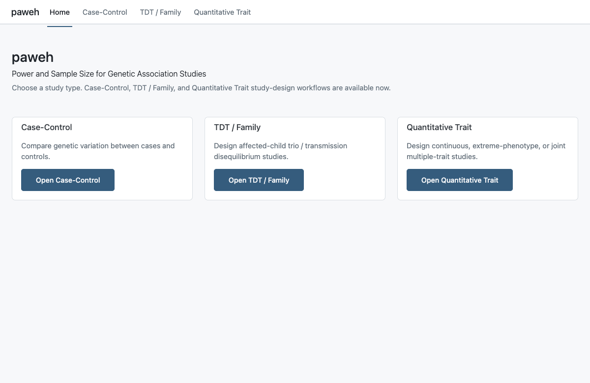
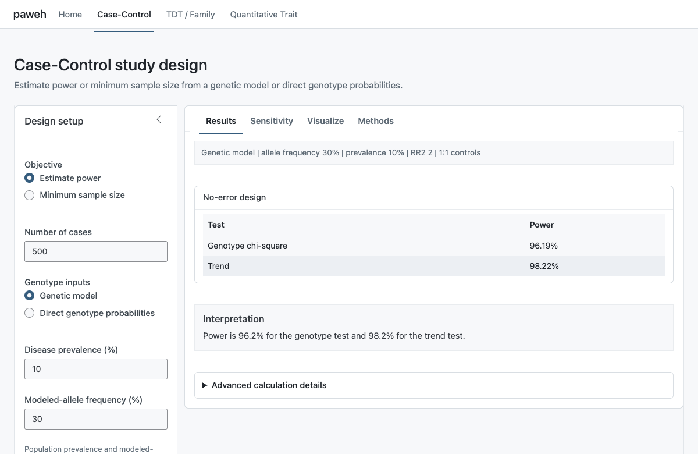
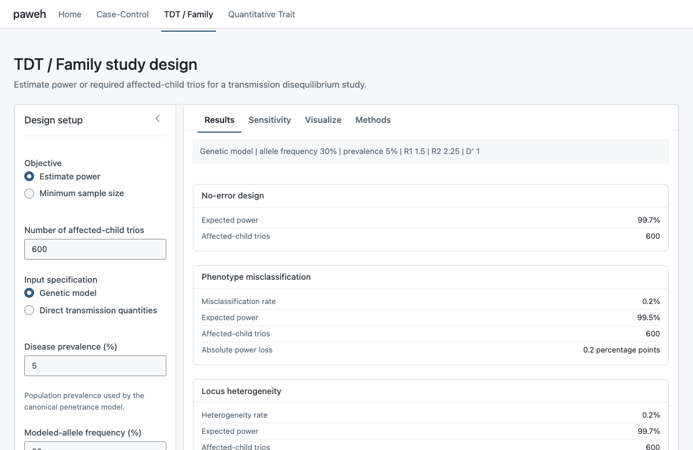
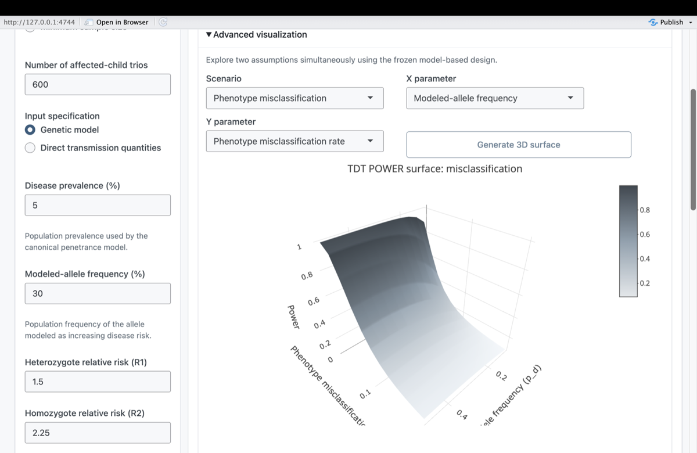

```{r setup, include=FALSE}
knitr::opts_chunk$set(collapse = TRUE, comment = "#>", fig.width = 7, fig.height = 5)
library(paweh)
```

# Introduction

`paweh` includes an interactive Shiny interface for Case-Control, TDT / Family,
and Quantitative Trait study-design calculations. The dashboard uses the same
canonical statistical functions as the programmatic R interface; it is an
interface to those functions, not a separate statistical engine.

This guide focuses on navigating the interface and carrying a design through
its workflow. For statistical definitions, assumptions, and derivations, use
the study-specific vignettes linked throughout this guide.

# Launching the dashboard

Construct the application and then launch the returned object explicitly:

```{r launch-dashboard, eval=FALSE}
app <- paweh_app()
shiny::runApp(app)
```

`paweh_app()` returns a `shiny.appobj`; it does not launch the application
automatically. Keeping construction and launch separate is useful in scripts,
tests, and deployment tooling. The vignette does not execute `runApp()`.

```{r shiny-home, echo=FALSE, out.width="100%", fig.cap="The paweh dashboard organizes study design by study family, with a dedicated workspace for each supported design.", fig.alt="Home page of the paweh dashboard showing Case-Control, TDT or Family, and Quantitative Trait study families."}

```

A typical workflow begins the same way in each workspace:

1. Choose a study family.
2. Select **Estimate power** or **Minimum sample size**.
3. Enter the model assumptions.
4. Select **Calculate study design**.

The Case-Control and TDT / Family workspaces then provide **Results**,
**Sensitivity**, **Visualize**, and **Methods** tabs, plus advanced details and
a reproducible R call. The Quantitative Trait workspace is intentionally
simpler: its **Output** card displays the verbose output from the corresponding
canonical QTL function.

> **Frozen calculated design.** Selecting **Calculate study design** evaluates
> the current inputs. Editing an input afterward does not partially update the
> previous result. The Case-Control and TDT / Family workspaces ask the user to
> recalculate to update their panels; the Quantitative Trait workspace reports
> “Inputs have changed. Recalculate to update output.”

# Case-Control workflow

The Case-Control workspace compares genotype distributions between cases and
controls. Choose whether to estimate power at a specified number of cases or
find the minimum sample size for a target power. Inputs may be specified as a
genetic model or as direct case and control genotype probabilities.

For a model-based design, core assumptions include disease prevalence,
modeled-allele frequency, the homozygote relative risk and mode of inheritance,
the case-to-control allocation, and the significance level. Advanced options
cover phenotype misclassification, genotype misclassification, and locus
heterogeneity. Their statistical definitions are described in the
[Case-Control Study Design](paweh-02-case-control-study-design.html) vignette.

A representative programmatic calculation corresponding to the dashboard is:

```{r cc-example}
cc_design <- cc_power(
  N_case = 500,
  alpha = 0.05,
  input_mode = "model_based",
  prev = 0.10,
  pd = 0.30,
  R2 = 2,
  MOI = "M",
  k = 1,
  verbose = FALSE
)

data.frame(
  test = c("Genotype chi-square", "Trend"),
  power = c(cc_design$tests$genotypes$power, cc_design$tests$trend$power)
)
```

```{r shiny-cc-results, echo=FALSE, out.width="100%", fig.cap="The Case-Control Results tab summarizes genotype chi-square and trend-test power for the frozen study design, with advanced calculation details available for review.", fig.alt="Case-Control dashboard showing calculated genotype chi-square and trend-test power with the frozen study-design summary."}

```

For power, Results reports the expected power of the genotype chi-square and
trend tests. For minimum sample size, it reports the required design size.
When an effective modifier is active, the dashboard distinguishes the
no-error baseline from adjusted results. These are deterministic calculations
under the entered assumptions, not estimates from observed data.

In Sensitivity, select one parameter and a range. Every other assumption stays
at its frozen value, and a vertical marker identifies the calculated design.
The plot may use a tightly zoomed y-axis to make small changes in power visible;
the interface notes when it does so. Visualize presents the current
case-control genotype comparison using the frozen design.

# TDT / Family workflow

The TDT / Family workspace designs transmission disequilibrium studies in
affected-child trios; the trio, rather than an individual participant, is the
sampling unit. Choose power or minimum sample size, then specify either a
genetic model or direct expected transmission quantities. Model-based inputs
include the heterozygote relative risk (R1), homozygote relative risk (R2), and
linkage disequilibrium measure D-prime, along with prevalence and allele
frequency. See [TDT Study Design](paweh-03-tdt-study-design.html) for the
underlying statistical model.

> **Separate TDT modifier scenarios.** Phenotype misclassification and locus
> heterogeneity are evaluated as separate TDT sensitivity scenarios. When both
> are enabled, the dashboard displays (1) the baseline/no-error design, (2) the
> phenotype-misclassification scenario, and (3) the locus-heterogeneity
> scenario. It does **not** interpret them as one joint combined TDT model.

For a genetic-model input, **Advanced assumptions** also offers the exact
control **Genotype misclassification (Chapter 5)**. Selecting it reveals
**Genotype misclassification rate (%)**, which accepts a percentage from 0 to
50; the interface converts that value to the package-scale proportion supplied
as `genotype_misclassification_rate`. This model is unavailable for direct
transmission quantities and must be used separately from phenotype
misclassification and locus heterogeneity. The interface reports a clear error
if those constraints are violated.

The Results and advanced-details panels report the no-error and Chapter 5
genotype-misclassification quantities returned by `tdt_power()` or
`tdt_mssn()`, including retained and Mendelian-inconsistent trio probabilities.
Sensitivity and advanced surface plots are not provided for this genotype-error
branch.

```{r shiny-tdt-modifiers, echo=FALSE, out.width="100%", fig.cap="The TDT Results tab keeps the baseline, phenotype-misclassification, and locus-heterogeneity scenarios separate when both modifiers are requested.", fig.alt="TDT dashboard displaying baseline, phenotype-misclassification, and locus-heterogeneity power scenarios separately."}

```

The transmission visualization compares expected transmitted and
non-transmitted quantities and labels them numerically from the canonical TDT
result. Sensitivity varies one parameter at a time while preserving the other
frozen assumptions.

An optional 3D surface explores two assumptions simultaneously. It is generated
only after the user requests it, uses the frozen model-based design, and does
not alter the primary calculation. Rotate the Plotly surface with click and
drag, and zoom or inspect values interactively.

```{r shiny-tdt-3d, echo=FALSE, out.width="100%", fig.cap="The optional TDT 3D surface explores two assumptions simultaneously while retaining the last calculated model-based design.", fig.alt="Three-dimensional TDT power surface over allele frequency and phenotype-misclassification rate."}

```

# Quantitative Trait workflow

The Quantitative Trait workspace is a thin input interface over the public QTL
functions. Its workflow is deliberately direct:

\[
\text{inputs} \longrightarrow \text{Calculate study design}
\longrightarrow \text{canonical verbose PAWEH output}.
\]

Choose **Estimate power** or **Minimum sample size**, enter the model inputs,
and select **Calculate study design**. The single **Output** card then shows the
verbose console presentation generated by the corresponding canonical
function. There are no QTL Results, Sensitivity, Visualize, Methods, advanced
decomposition, or 2-D/3-D Plotly panels in the current dashboard.

The workspace exposes three designs:

- **Full continuous trait** calls `qtl_anova_power()` or `qtl_anova_mssn()`.
- **Extreme phenotype sampling** calls `qtl_threshold_chisq_power()` or
  `qtl_threshold_chisq_mssn()`.
- **Multiple quantitative traits** calls `qtl_multivariate_power_full()` or
  `qtl_multivariate_mssn_full()`, using either the Pillai continuous-trait test
  or joint threshold-selected genotype chi-square test.

Common controls include objective-specific sample size or target power,
significance level, and modeled-allele frequency. The continuous design adds
QTL variance, dominance, and genotype-count options. The extreme design adds
upper- and lower-tail percentages and their selected-sample ratio. The
multivariate design accepts two to four phenotype-specific QTL variances and
dominance values, pairwise phenotype correlations, and joint-tail inputs when
the threshold test is selected.

If inputs change after a calculation, the previous verbose output remains
visible with the notice **Inputs have changed. Recalculate to update output.**
The [Quantitative-Trait Study Design](paweh-04-quantitative-trait-study-design.html)
vignette provides the statistical interpretation and approved model
visualizations outside the dashboard.

## Full continuous trait

This design analyzes the measured quantitative phenotype directly. Enter total
sample size for power or target power for MSSN, QTL variance explained,
dominance, allele frequency, and the optional genotype-count settings. The
Output card presents the canonical ANOVA result.

## Extreme phenotype sampling

This design analyzes individuals selected from the lower and upper phenotype
tails. The user enters population-tail percentages and an upper-tail selected
sample for power, or target power for MSSN. The model determines the phenotype
thresholds, and the Output card reports the canonical threshold-design result.

## Multiple quantitative traits

The calculation supports two to four traits, with trait-specific variance
explained and dominance values plus pairwise phenotype correlations. Choose a
Pillai continuous-trait test or joint extreme-selection test. For the latter,
enter upper and lower percentages for every trait and the lower-to-upper
selected-sample ratio. All selected traits enter the canonical calculation;
the current QTL workspace does not add a separate plot.

# Detailed panels in Case-Control and TDT

In the Case-Control and TDT / Family workspaces, **Advanced calculation
details** exposes deeper quantities returned by the same canonical calculation
used for the primary result. Depending on the workflow, these can include
genotype probabilities, expected transmission quantities, noncentrality
parameters, degrees of freedom, and fractional minimum sample size. Not every
field appears for every model.

**Methods** summarizes the statistical procedure and assumptions for the
frozen design. It complements Advanced calculation details: Methods explains
what procedure is being used, while Advanced calculation details shows
quantities produced by that calculation. These panels are not part of the
current Quantitative Trait workspace.

# Reproduce calculations in R

The Case-Control and TDT / Family advanced details include a **Reproduce in R**
block generated from the frozen inputs. It uses the same canonical public
function and arguments as the dashboard calculation. For example, a
model-based TDT design may produce:

```{r reproduce-tdt, eval=FALSE}
tdt_power(
  N = 600,
  alpha = 0.05,
  input_mode = "model_based",
  prev = 0.05,
  pd = 0.30,
  R1 = 1.5,
  R2 = 2.25,
  delta_prime = 1,
  verbose = FALSE
)
```

Copy this code into a script to preserve or extend the design. For QTL, use the
canonical function identified above with the same inputs entered in the GUI;
the dashboard itself displays that function's verbose output rather than a
separate generated call block.

# Frequently asked questions

**Why did my result not change when I edited an input?**

The dashboard preserves the last calculated design until **Calculate study
design** is selected again.

**Why is the sensitivity plot y-axis zoomed?**

A tighter scale makes small changes in power easier to see. The dashboard
displays a note when the scale is tightly zoomed.

**Why can minimum sample size be `Inf`?**

For a model with no detectable contrast or effect, no finite sample size can
reach the requested power.

**Why are TDT error and heterogeneity mechanisms shown separately?**

Phenotype misclassification and locus heterogeneity are separate sensitivity
scenarios rather than one combined model. Chapter 5 genotype
misclassification is also modeled separately and cannot be combined with
either of them.

**Why does the QTL workspace show only console-style output?**

It is intentionally a thin GUI over the canonical QTL functions. The dedicated
QTL vignette and plotting functions provide model visualizations.

**Why does the TDT 3D plot not appear immediately?**

The TDT Plotly surface is generated on demand to keep startup responsive.

**What is the difference between Advanced calculation details and Methods in
the Case-Control and TDT workspaces?**

Advanced details shows model and calculation quantities; Methods summarizes
the statistical procedure and assumptions.

# Dashboard and programmatic workflows

Use the Case-Control and TDT / Family workspaces for interactive study planning,
sensitivity inspection, and visualization. Use the Quantitative Trait
workspace as a compact input front end to canonical verbose output. Use the
public R functions for scripted workflows, reproducible pipelines, batch
analyses, and code accompanying manuscripts or supplements. Every workspace
delegates its calculations to the same statistical backend as those functions.

# Further reading

This vignette teaches the dashboard interface. The other articles explain the
statistical methods and parameters in greater detail:

- [Getting Started](paweh-01-getting-started.html)
- [Case-Control Study Design](paweh-02-case-control-study-design.html)
- [TDT Study Design](paweh-03-tdt-study-design.html)
- [Quantitative-Trait Study Design](paweh-04-quantitative-trait-study-design.html)

# Session information

```{r session-info}
sessionInfo()
```
